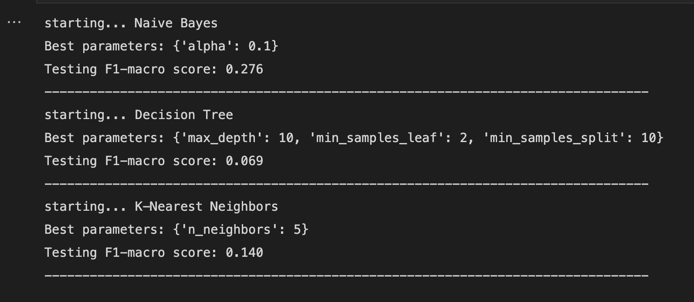
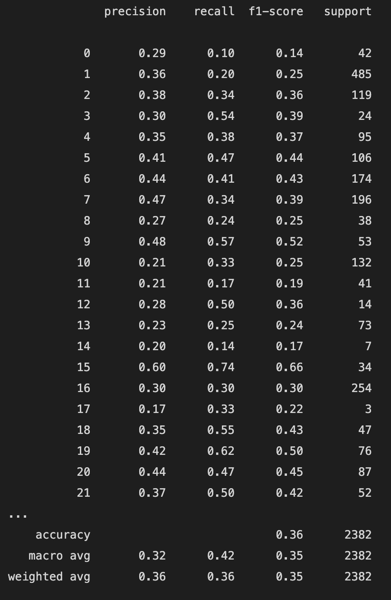

# Medical Transcript Classification using Naive Bayes Classification Model

## Table of Contents

- [Background](#background)
- [Data](#data)
- [Methodology](#methodology)
- [Technology Stack](#technology-stack)
- [Conclusion](#conclusion)
- [Contributing](#contributing)

## Background

Medical transcription is the process of transcribing medical records from spoken word to text format. In this project, we focused on classifying the medical transcript data and determining the medical specialty to which the transcription should be sent to. The goal is to streamline the process of medical transcription and reduce the time taken to classify the transcription manually.

## Data

We used a dataset of medical transcripts collected from various medical specialties. The dataset consisted of around 4,000 transcripts, and we split the dataset into training and testing datasets. We ensured that both the training and testing datasets had a similar distribution of transcripts across the medical specialties.

## Methodology

We used the Naive Bayes theorem to classify the medical transcript data. Naive Bayes is a probabilistic algorithm that calculates the probability of a given input belonging to a particular class. We used the Multinomial Naive Bayes algorithm, which is commonly used for text classification tasks. 

We preprocessed the data by removing stop words, stemming the words, and converting the text to lowercase. We then used the CountVectorizer function from scikit-learn to convert the text into a matrix of word frequencies. We trained the Multinomial Naive Bayes algorithm on the training data and evaluated its performance on the testing data.

## Technology Stack

We used the following technologies to build our project:

- Python
- PyTorch
- scikit-learn
- JupyterNotebook
- NLTK (natural language processing tools)

The program will load the dataset, preprocess the data, and train the Multinomial Naive Bayes algorithm on the training data. It will then evaluate the performance of the algorithm on the testing data and output the accuracy score.

## Conclusion

In conclusion, our project demonstrates the effectiveness of using the Naive Bayes theorem for medical transcript classification. By automating the process of classifying medical transcripts, we can streamline the process of medical transcription and reduce the time taken to classify the transcription manually.

## Contributing

Contributions are welcome! Please open an issue or submit a pull request if you would like to contribute to this project.

